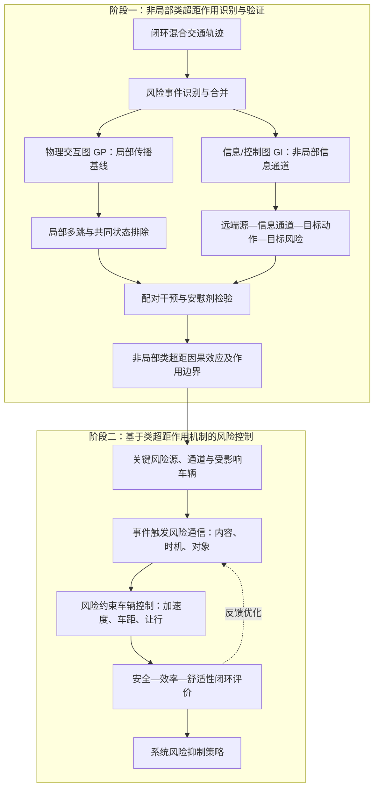

# 一、课题的界定

## 1.1 研究对象

本课题研究混合自动驾驶交通中，某一源区域的交通状态或风险扰动如何改变另一目标区域的车辆碰撞冲突风险。研究对象是车辆级连续碰撞冲突过程，TTC、THW、DRAC、急刹和碰撞是同一冲突过程的观测属性，不把拥堵、排队或速度下降本身称为碰撞风险。

拥堵和需求变化可以作为源区扰动，也可以作为安全—效率评价中的交通背景。例如本周实验提高上游匝道需求，是为了改变到达合流点的交通状态；真正的结果变量仍是下游合流冲突区的TTC负担、急刹、碰撞及效率指标。

## 1.2 类超距作用的定义

普通意义上的“超距作用”难以成立。因此本课题不主张无通道、瞬时或量子意义上的物理超距，而把研究对象收敛为：

> **显式信息或控制通道介导的非最近邻作用**。源区车辆或区域状态不沿普通跟驰—制动链逐车传递，而是通过通信、前视感知或集中控制通道跨越中间车辆，直接进入远端目标车辆的决策，并进一步改变目标区域的碰撞冲突风险。

这种作用可以称为“类超距作用”“通信介导的跨区域作用”或“非最近邻控制影响”。“类”字表示它在交通系统中的表现类似跨越局部邻接链的远端影响，但仍然具有明确的信息载体、传播时间和控制路径。

类超距候选至少需要满足四个条件：

1. 源区域与目标区域在道路拓扑上分离，普通局部作用需要经过中间车辆或区域逐级传递；
2. 存在可观察的通信、感知或控制通道，使源区信息直接进入目标车辆决策；
3. 日志能够证明消息被生成、传输、接收和实际采用，而不是只有空间相关性；
4. 在相同场景和随机种子下关闭该通道后，目标区风险结果发生可复现变化。

仅仅距离较远、两个区域同时变化，或者时序模型发现显著滞后关系，都不能单独证明类超距作用。

## 1.3 需要回答的研究问题

本课题目前聚焦以下问题：

1. 在混合自动驾驶合流场景中，上游匝道需求变化能否通过跨支路ETA通信改变下游合流冲突区的碰撞风险？
2. 这种影响能否与普通跟驰、制动、交通波和共同交通状态造成的局部多跳传播区分？
3. 通信时延、丢包、更新周期和信息年龄如何改变该作用及其安全—效率代价？
4. 哪些证据足以把“远距离相关”提升为“通信介导的因果作用”？

# 二、本周新增文献补强

本周文献补查的重点从一般风险图和抽象非局部概念，转向“通信状态—控制决策—交通安全”的真实中介链。下面逐篇说明新增核心文献及其与本课题的关系。

## 2.1 Hasan、Girs与Uhlemann（2023）：瞬时通信中断与自主容错

论文题为 *Characterization of Transient Communication Outages Into States to Enable Autonomous Fault Tolerance in Vehicle Platooning*，发表于 *IEEE Open Journal of Intelligent Transportation Systems*，DOI为10.1109/OJITS.2023.3237958。

**解决的问题。** 车辆编队为了节能和提高道路容量，需要在高速下维持很短的车距，但无线链路会因竞争、衰落和连续丢包发生暂态中断。把链路简单写成“正常/失效”无法回答两个不同问题：正常巡航时如何在通信变差后继续安全运行（fail-operational），以及出现道路危险时如何迅速安全停车（fail-safe）。

**使用的方法。** 作者分别监控车辆到领航车的链路`c2l`和到正前车的链路`c2f`，按连续丢失消息数量或中断持续时间把通信质量分为good、fair和poor。论文据此构造状态机，并提出渐进降级与恢复方法GDU：通信良好时采用高协同、短车距的PLATOON控制；链路变差时先进入间距调整状态，再依次退化到CACC和主要依靠本车传感器的ACC；通信恢复后反向升级。发生危险时，作者又提出增强同步制动ESB：领航车和中间车辆先轻制动，约定时刻再同步全力制动，末车收到危险消息后可直接全力制动。实验在Plexe、SUMO和Veins联合仿真中进行，包括7车编队、100 km/h、高密度道路/数据流量和13组通信阈值组合。

**结果与结论。** 在论文开展的正常巡航仿真中，GDU在全部阈值组合下均避免了碰撞；但较低阈值会导致频繁切换控制器和车距，虽然更加保守，却损害燃油效率和串列稳定性。紧急制动中，GDU与ESB组合在65次仿真中的64次避免碰撞；普通制动即使配合GDU仍出现44次碰撞。ESB还比原同步制动策略将领航车停车距离缩短12.84 m。作者因此认为通信阈值必须与消息频率、车距、车速和制动能力联合设计，而不能脱离交通状态固定设置。

**对本课题的启发。** 这篇文章最重要的启发是建立“通信质量状态—控制模式/车距—车辆运动—安全结果”的机制链，说明通信不是仿真背景参数，而是会改变控制行为的系统状态。需要修正原先的过度延伸：论文并没有提出“消息生成—发送—交付—缓存—信息年龄”的完整ETA生命周期；这是本课题在其状态化思想上的进一步实现。该文面向纵向编队，也没有识别跨支路源区对固定目标区TTC风险的因果作用。

## 2.2 Razzaghpour等（2023）：预测式和控制感知通信

论文题为 *Predictive Model-Based and Control-Aware Communication Strategies for Cooperative Adaptive Cruise Control*，发表于 *IEEE Open Journal of Intelligent Transportation Systems*，DOI为10.1109/OJITS.2023.3259283。

**解决的问题。** 传统CACC通常按固定频率广播车辆状态，即使车辆状态几乎没有变化也持续占用信道。随着联网车辆数量增加，这种时间触发通信会造成不必要的通信负载，反过来可能加剧拥塞、丢包和时延。论文希望在明显减少通信次数的同时，维持接近周期通信的闭环跟驰性能。

**使用的方法。** 作者把全分布式事件触发通信ETC与模型通信MBC结合。每辆车不必持续接收邻车的原始状态，而是利用最近一次收到的车辆动态/驾驶行为模型运行远端状态估计器；只有当估计误差或控制性能误差超过设定阈值时，发送方才更新模型。论文比较10 Hz固定周期通信、绝对状态触发、控制感知触发和模型触发等策略，并在不同丢包率和触发阈值下考察车距、速度与加速度误差。

**结果与结论。** 模型触发通信的平均发送频率约为1.80 Hz，相比10 Hz周期通信减少约82%，同时速度偏差小于1%。结果也显示阈值控制着明确的通信—控制权衡：阈值较高时通信更少，但模型长时间不更新会积累更大误差；阈值较低时控制更精确，却重新增加网络负载。作者的结论不是“发送越多越好”，而是应当按照闭环控制误差决定何时更新。

**对本课题的启发。** 本课题当前的更新周期、最大缓存年龄和丢包率不应只作为网络层参数报告，还应与`applied`后的加速度变化和目标区风险联合分析。进一步可以建立控制感知更新baseline：只有当新ETA可能改变让行决策时才发送，而不是无条件周期广播。不过，该文优化的是纵向CACC的通信效率，并没有研究跨支路ETA、合流冲突区或源—目标区域配对反事实。

## 2.3 Wang等（2024）：动态通信拓扑下的稳定性与安全

论文题为 *Stability and Safety Analysis of Connected and Automated Vehicle Platoon Considering Dynamic Communication Topology*，发表于 *IEEE Transactions on Intelligent Transportation Systems*，DOI为10.1109/TITS.2024.3398111。

**解决的问题。** 通信故障、丢包、时延或网络攻击会使车辆可获得的前车信息不断变化，因此实际信息流拓扑不是固定图。固定拓扑CACC无法说明某条链路失效后车辆应当依赖哪一辆前车，也可能低估拓扑切换带来的串列不稳定和追尾风险。

**使用的方法。** 论文提出基于动态权重优化的跟驰模型DWOC，采用多前车跟随模式，使车辆能够获得前三辆前车的动态信息，并根据链路状态自适应调整不同信息源的权重。作者从模型中推导串列稳定条件，再通过数值实验比较不同通信时延和拓扑变化下的稳定性与安全表现。

**结果与结论。** 可核验的正式摘要表明，DWOC在不同通信时延下均能改善车队的稳定与安全性能，结论是**控制器设计必须显式考虑通信拓扑变化，而不能只为单一固定连接关系调参**。目前取得的公开材料未给出各场景的具体改善幅度，因此这里不写未经全文核对的百分比或碰撞数量。

**对本课题的启发。** 本课题应将普通leader/follower关系记为局部物理边$E_P$，把跨支路消息的发送者—接收者关系记为信息边$E_I$，并在日志中保留每一步实际选择的远端车辆ID、消息是否到达和是否被采用。这样才能判断结果变化来自物理跟驰链还是信息拓扑变化。该研究仍是纵向编队稳定性分析，不能直接代替合流场景中的固定目标区风险实验。

## 2.4 Wang等（2025）：含时延混合车队的知识引导自学习控制

论文题为 *Knowledge-Guided Self-Learning Control Strategy for Mixed Vehicle Platoons with Delays*，发表于 *Nature Communications*，DOI为10.1038/s41467-025-62597-x。

**解决的问题。** 混合车队同时存在两类不确定性：人工驾驶车辆行为随机且异质，联网自动驾驶车辆的控制指令又会受到共享无线网络随机时延影响。传统解析控制通常依赖已知且同质的驾驶参数，普通深度强化学习又难以稳定学习交通机理，因此论文希望构造能够同时适应人工驾驶行为和随机通信时延的混合车队控制器。

**使用的方法。** 作者将一般混合车队分解为若干“CV—多辆HV—CV”子车队，结合运动波理论和Newell跟驰模型，从连续聚合行为中估计人工驾驶车辆的时变期望车头时距和停车间距，用于预测其轨迹。控制层采用知识引导的Soft Actor-Critic；为补偿当前状态和控制指令的时延，状态向量除位置、速度和间距误差外，还加入若干历史控制指令。论文在车辆—道路—云框架下训练和测试，并以CVDS-IDM、DDPG和PPO等作为对照。

**结果与结论。** 论文利用NGSIM数据和多种定制仿真场景，从交通稳定性、乘坐舒适性、能耗、振荡衰减以及人工车辆换道扰动鲁棒性等方面评价方法。作者报告该策略总体优于上述对照方法，在合流和分流测试场景中实现零碰撞，并能在车辆数量和混合拓扑变化时维持可接受性能。证据边界是：论文验证主要来自数据驱动测试和仿真，作者把真实车队部署列为未来工作，因此不能写成已经完成真实道路车队验证。

**对本课题的启发。** 延迟只有真正进入车辆决策并改变加速度后才会形成交通作用，所以本课题必须同时报告消息交付/年龄、控制采用、加速度变化、目标区TTC风险和效率指标。历史控制输入补偿时延的做法还可作为后续预测补偿baseline。该文没有对指定源区—通信通道—目标区构造同seed开关反事实，因此仍不能直接证明跨支路类超距作用。

## 2.5 Liu、Somarakis与Motee（2026）：延迟通信下的级联碰撞风险

论文题为 *Risk of Cascading Collisions in Network of Vehicles With Delayed Communication*，发表于 *IEEE Transactions on Automatic Control*，DOI为10.1109/TAC.2025.3640000。

**解决的问题。** 已有车队风险研究常分析单一车辆对的碰撞概率，但一次碰撞发生后，其他车辆对的风险如何变化，以及通信时延、拓扑和外部扰动怎样共同决定这种级联风险，仍缺少可计算框架。

**使用的方法。** 作者建立带通信时延和随机输入扰动的线性车辆网络模型，以稳态车间距为随机变量，把一个或多个车辆对已经发生碰撞视为条件观测。通过条件高斯统计和Average Value-at-Risk构造级联碰撞风险，推导一般图以及complete、path和$p$-cycle等特殊通信图上的闭式表达，并进一步给出通信时延与图连通性造成的最低可达风险界。数值案例主要用20辆车比较故障规模、空间位置、加边/删边和噪声分布的影响。

**结果与结论。** 论文证明级联风险不仅取决于碰撞车辆与目标车辆之间的物理距离，还取决于车间距协方差和通信图结构；时延会对可达到的最低风险形成基本限制。案例表明，增加局部通信边并不总能降低级联风险，长距离通信也并非必然最优，在其path图设置中中等通信范围反而给出更好的级联风险表现。更重要的是，最小化单次碰撞风险和最小化级联碰撞风险可能要求不同的通信拓扑。

**对本课题的启发。** 这是七篇中最接近“通信条件—碰撞级联风险”的理论baseline，它直接支持通信拓扑和时延可能产生非单调安全效应，提醒我们不能预设通信越强、信息越远就越安全。但它研究的是纵向稳态随机车队和条件风险，不是合流场景中的固定目标区连续TTC负担，也没有通过通道开关辨识源区到目标区的机制因果效应。

## 2.6 Huang与Du（2022）：联网车辆的非局部交通流模型

论文题为 *Stability of a Nonlocal Traffic Flow Model for Connected Vehicles*，发表于 *SIAM Journal on Applied Mathematics*，DOI为10.1137/20M1355732。

**解决的问题。** 联网车辆能够获得当前位置以外一定范围内的交通密度信息，但经典LWR模型只让速度依赖本地密度。论文希望回答：把有方向、有范围的非局部信息纳入速度选择后，均匀交通流是否稳定，交通波在什么条件下能够消散。

**使用的方法。** 作者研究带非局部项的LWR标量守恒律，用空间积分核对前方一定范围内的密度加权，并借助非局部梯度和非局部Poincaré不等式证明全局稳定性；随后用不同初始波形、核函数和作用范围做数值比较。这里的“非局部”具有明确的空间范围和权重核，不是无载体、瞬时发生的物理超距。

**结果与结论。** 当核函数随距离非增且不是常数时，模型解能够指数收敛到均匀交通流，交通波逐渐消散；如果对作用范围内远近信息赋予相同权重，即使用常数核，非均匀交通形态可能长期存在。参数分析还说明非局部作用范围需要合理选择，不是观察范围越大就必然越稳定。

**对本课题的启发。** 本课题可以据此把“类超距作用”严格界定为具有来源、方向、范围、权重和信息通道的非最近邻作用。跨支路ETA消息相当于离散车辆层面的有向非局部信息边，而不是量子或无通道超距。不过该文是宏观稳定性理论，没有车辆级丢包、消息采用、碰撞冲突和源—目标开关反事实，不能单独作为本课题因果结论的证据。

## 2.7 Hui与Zhang（2025）：混合交通中的前视效应

论文题为 *An Anisotropic Traffic Flow Model with Look-Ahead Effect for Mixed Autonomy Traffic*，发表于 *Transportation Research Record*，DOI为10.1177/03611981251381306。

**解决的问题。** Huang与Du主要研究单类联网交通，尚未说明CAV和人工驾驶车辆混合存在时，CAV有限前视能力、渗透率和空间分布如何共同影响交通波稳定性。该文因此研究混合自主交通中的有向前视效应。

**使用的方法。** 作者扩展各向异性的Aw–Rascle–Zhang非平衡交通流模型，在松弛项中加入一定前视距离内的非局部平均密度，再扩展为CAV—HDV多类别模型。论文先用波动扰动分析推导稳定性条件，然后设置15、100和1000 m前视距离，并改变CAV渗透率和均匀/聚集分布进行数值实验。

**结果与结论。** 理论上，更长前视距离可以放宽稳定条件；但数值结果并不单调：100 m前视比15 m和1000 m更快收敛，过短范围接近只看一辆前车，过长范围则引入过多远端信息，反而减慢响应。在论文的参数设置中，10% CAV未能稳定交通，20%能减小振荡，40%收敛更快；均匀分布仅比聚集分布略好，空间分布影响小于渗透率。

**对本课题的启发。** 后续实验应把信息范围、更新周期、通信质量和CAV渗透率作为可变化的“信息剂量”，检验是否存在最优区间或方向反转，而不能预设“通信越多越安全”。本周不同需求和渗透率下风险方向不完全一致，可以被表述为待验证的非单调现象，但不能直接套用该宏观模型解释。该文没有车辆级消息生命周期、合流冲突和源—目标反事实。

## 2.8 文献补强后的认识

这七篇文献可分成三个证据层次。Hasan、Razzaghpour和两篇Wang论文说明微观层面的“通信状态/时延/拓扑—控制器—车辆运动”链；Liu等把通信时延和拓扑直接连接到级联碰撞风险；Huang与Du、Hui与Zhang则从宏观交通流角度界定有方向、有范围的非局部信息作用及其非单调稳定效应。

**它们共同支持的结论是**：通信介导的远端作用必须同时考虑通信状态、信息来源与拓扑、信息时效、控制器是否实际采用以及最终安全结果。它们尚未共同完成的是：在合流场景中，把“指定源区域扰动—显式跨支路消息通道—指定目标区域碰撞冲突风险”作为一个闭环对象，利用同场景、同seed的通道开关和机制日志做配对干预。本课题的研究切口因此不是重新证明通信会影响控制，而是识别这种跨区域信息作用是否真实到达、实际被采用，并对固定目标区风险产生可复现的因果影响。

# 三、拟采用的方法框架

本课题采用“非局部类超距作用识别—基于作用机制的风险控制”两阶段框架。第一阶段区分普通局部传播与信息介导的非局部类超距作用，识别远端风险如何经指定通道改变目标车辆及其局部邻车的风险；第二阶段把识别出的“源—通道—目标”机制转化为通信与控制策略，降低目标区域及系统整体风险。

这里的**非局部类超距作用**不是无通道、瞬时发生的物理超距作用，而是指：当源车辆与目标车辆不是直接leader/follower或同一物理冲突对时，源风险状态仍通过可追踪的信息或控制通道进入目标车辆决策，并在闭环干预下稳定改变目标区域的后续风险。对这一作用进行可操作定义和闭环因果验证，是本课题的方法核心。

## 3.1 第一阶段：局部传播与非局部类超距作用识别

1. **风险事件表征。** 从闭环轨迹中提取低TTC、低THW、高DRAC和急刹等状态，并将同一车辆或车辆对的连续记录合并为风险事件。
2. **局部与非局部通道分离。** 建立物理交互图$G_P$和信息/控制图$G_I$。$G_P$描述leader/follower、合流冲突和交通波等局部传播；$G_I$记录远端消息来源、接收对象、时延、丢包、信息年龄及控制采用，描述非局部信息暴露。
3. **类超距因果验证。** 固定源区域、信息通道和目标区域，开展“源风险有/无×通道开/关”的配对闭环实验。只有同时满足“源与目标不存在直接物理作用、存在明确$G_I$通道、通道干预后目标风险稳定变化”，才能判定信息介导的非局部类超距作用；消息置乱、错误源区和处理前效应用于排除局部多跳传播及共同交通状态造成的伪相关。
4. **作用规律提取。** 估计非局部类超距作用的方向、距离、时延、放大或衰减程度及其置信区间，分析交通需求、自动驾驶渗透率和通信质量对作用强度的影响，确定其成立条件和作用边界。

## 3.2 第二阶段：基于传播机制的风险控制

1. **干预对象选择。** 根据第一阶段识别出的非局部“源—通道—目标”链条，确定关键风险源、风险放大节点和易受影响车辆。
2. **风险信息通信。** 采用事件触发方式发送风险类型、强度、位置、发生时间和有效期，根据信息图确定发送时机和接收车辆，利用非局部信息提前干预尚未直接接触风险源的目标车辆。
3. **车辆响应控制。** 在现有车辆控制器上引入风险约束的滚动优化，根据接收到的风险信息调整加速度、车距和合流让行，同时限制急刹、碰撞风险和动作波动。
4. **闭环评价优化。** 比较控制前后的TTC冲突负担、急刹、碰撞、速度、出流和舒适性，在安全、效率与通信成本之间确定可实施的控制策略。

# 四、本周显式ETA通信实验及结果

## 4.1 实验设置

本周把上周直接读取当步远端ETA的开关，升级为“生成—发送—丢包/时延—交付—缓存—年龄检查—控制采用”的显式通信过程。发送端为合流点另一支路的远端车辆，接收端为受控自动驾驶车辆；控制器只能使用已交付且未过期的ETA，不能回退读取当步真实值。日志记录消息来源、交付与年龄、候选触发、实际采用以及采用前后的动作。

| 条件            | 远端信息来源  | 通信设置                    | 作用       |
| ------------- | ------- | ----------------------- | -------- |
| off           | 不采用     | 无                       | 无通信反事实   |
| oracle        | 当步原始ETA | 不经过消息通道                 | 上周直接信息基线 |
| comm-ideal    | 已交付消息   | 0步时延、0丢包、每步更新、最大缓存2步    | 显式通信主处理  |
| comm-impaired | 已交付消息   | 3步时延、20%丢包、每2步更新、最大缓存6步 | 通信质量消融   |

源区域$A$为上游合流匝道，主线流量固定为2000 veh/h，匝道需求设置为100/180 veh/h。目标区域$B$预先固定为下游合流冲突区（`bottom`、`left`或`:center_1`，$x\in[540,612]$ m）。主实验为源需求（名义/高）×通信通道（off/comm-ideal）的$2\times2$配对设计，覆盖p60、p80和两个随机种子；加入oracle与comm-impaired后共完成32次有效运行。

主要风险指标是目标区有效leader车辆步上的TTC冲突负担：

$$
B_{TTC}=\frac{1}{N_{valid}}
\sum_{k=1}^{N_{valid}}(2-TTC_k)_+.
$$

同时报告TTC<2 s比例、急刹、速度、出流和碰撞，并统计消息发送、丢包、交付和采用次数。

## 4.2 实验结果

最终32个有效运行全部完成，碰撞总数为0。机制审计结果为：off实际应用0次，oracle应用4711次，comm-ideal应用5018次，comm-impaired应用2809次。受损通信发送3670条消息、丢弃706条，观测丢包率为19.24%，与20%的配置一致。

主$2\times2$实验的目标区TTC冲突负担如下：

| 源需求 | 渗透率 |      off | comm-ideal |      通信效应 |
| --- | --: | -------: | ---------: | --------: |
| 名义  | p60 | 0.008066 |   0.004938 | -0.003128 |
| 名义  | p80 | 0.002744 |   0.003107 | +0.000363 |
| 高需求 | p60 | 0.004082 |   0.005448 | +0.001366 |
| 高需求 | p80 | 0.002941 |   0.004872 | +0.001931 |

四个seed×渗透率组合的“源需求×通信”交互均为正，初步提示高匝道需求会使通信对TTC冲突负担的影响相对更不利。受损通信相对理想通信，在高需求p60/p80下分别增加0.001732/0.008064的TTC冲突负担，并增加2.027/7.025次每千车辆步的急刹。

但不同指标并不完全同向。理想通信在名义需求下减少急刹，而TTC<2 s比例未全面下降；速度和出流也随条件变化。因此当前只能说通信介导作用已经能够被实现和测量，不能说通信总体上必然提高安全。

# 五、下一步计划

1. **撰写论文前半部分**：完成引言、相关工作、问题定义和两阶段方法框架初稿。
    
2. **开展真实风险传播实验**：构造明确源风险事件，将ETA升级为风险消息，并推进“源风险有/无×通信开/关”的配对实验。
    
3. **验证并分析传播机制**：检查“源风险—非局部通道—车辆动作—目标风险”链条，初步分析局部传播与类超距作用。
